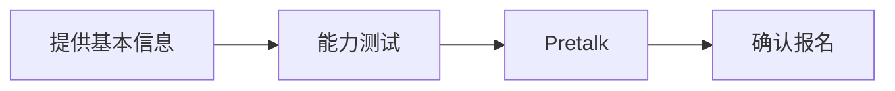

# 112923 简奥斯汀论文竞赛

## 单科学术顾问计划 (英语) PPD V2

### 目 录

一、 背景介绍 2
1. 比赛背景 2
2. 具体信息 2
3. 比赛亮点 2
二、 产品介绍 3
1. 产品名称： 3
2. 产品内容 3
3. 适合学员 4
4. 报名流程： 4
5. 产品特色 5
6. 协议与退费 5
三、 团队配置 5
# 一、 背景介绍

## 1. 比赛背景

简奥斯汀论文竞赛 (Jane Austen Essay Contest) 是由北美简奥斯汀协会 JASNA 主办的针对全世界范围中学生和大学生的论文比赛。其使命是在尽可能广泛的读者中促进对简·奥斯丁的作品、生平和才华的研究、欣赏和理解。简·奥斯汀 (Jane Austen) 是一位英国小说家，被誉为英国文学史上最伟大的作家之一。她的作品以独特的社交洞察力、幽默和深刻的人物描写而著称，作品中常以女性为主角，主要作品包括《傲慢与偏见》、《理智与情感》、《爱玛》等。

JASNA 每年都会举办简奥斯汀论文竞赛，来自全球各地的学生都可以参赛，争夺三个组别的奖学金，即高中组、大学本科组、研究生组。该竞赛的基本要求是围绕简奥斯汀的作品，结合每年的参赛题目，写成一篇文学分析论文。

## 2. 具体信息

1) 官方网站：https://jasna.org/programs/essay-contest/

2) 任务要求：围绕每年公布的选题，针对简奥斯汀的作品写成一篇 6-8 页的文学论文。

3) 面向人群：全球所有高中和大学生皆可参加。

4) 比赛时间：

* 开放选题时间：每年 11 月

* 接收投稿时间：次年 2 月

* 截稿时间：次年 6 月

* 结果公布：次年 8 月

5) 赛制规则：分为高中组和大学组。高中组可以只根据简奥斯汀一部作品写成论文；大学组需要根据至少两部作品写成论文。

6) 奖项设置：

* 第一名：获得 1000 美元奖金，并免费成为 JASNA 会员，并受邀参加 JASNA 每年在北美举办的学术会议，免费安排两晚住宿（不提供会议的交费用）。

* 第二名：获得 500 美元奖金。

* 第三名：获得 250 美元奖金。

* 所有获奖者还将获得 JASNA 一年的会员资格，其论文将在该网站上发表，并获得简·奥斯丁小说珍藏版一套。

## 3. 比赛亮点

1) **比赛含金量和权威度高**。简奥斯汀论文竞赛在英语文学领域属于第一梯队竞赛，由北美简奥斯丁学会主办，面向全世界高中生，大学生和研究生。在高中阶段如果完成这样的学术挑战能充分展示学生的文学知识储备和写作功底，提升学生在大学申请中的竞争力。

2) **写作对象明确且文学价值高**。简奥斯汀被公认为是英国文学史上最重要的作家之一，作品具有极高文学价值，对此写成的文学分析论文也具有潜在高文学价值。
3) **阅读范围聚焦**。简奥斯汀短暂的一生中只创作了六部小说。对参赛者而言，可以通过聚焦于她的一部或者几部作品，来写成自己的参赛论文。

4) **每年固定选题，开放选材**。JASNA 会提前发布每年的论文竞赛选题，选手们根据选题可以自由选择自己分析的书目。

5) **体现人文学术能力，为申请加分**。此竞赛为英语文学领域知名度最高的学生比赛，对于需要申请人文专业的学生是一个极佳的学术证明。

## 二、 产品介绍

### 1. 产品名称：

简奥斯汀论文竞赛 单科学术顾问计划 (英语)

本文件旨在介绍【单科学术顾问计划-简奥斯汀论文竞赛-英语】所对应的课程内容。

该产品的目标是协助学生产出参赛论文，达到参赛的标准，并投稿参赛。

### 2. 产品内容

<table>
  <thead>
    <tr>
        <th>序号</th>
        <th>模块</th>
        <th>内容说明</th>
        <th>形式*</th>
        <th>课时 (45min)</th>
    </tr>
  </thead>
  <tbody>
    <tr>
        <td>1</td>
        <td>赛事介绍、 范文分析、 学术写作方法</td>
        <td>进行具体的赛事介绍，结合赛事优秀范文，讲解、强化学术写作与调研方法理论知识。学术写作方法主要包括文学分析、写作结构、内容组成、行文逻辑、论证方法、引用格式等。</td>
        <td>CT</td>
        <td>2</td>
    </tr>
    <tr>
        <td>2</td>
        <td>选题分析、 主题调研</td>
        <td>选题讲解、破题思路拓展。结合学生背景、兴趣，针对具体选题进行头脑风暴会议，协助学生确定选题。并讲解学术调研方法，包括调研平台、文学学科权威研究资源介绍等内容。</td>
        <td>CT+NCT</td>
        <td>3</td>
    </tr>
    <tr>
        <td>3</td>
        <td>学术文献收集和分析</td>
        <td>针对学生选题，分析优质参考文献，讲解文献的论证结构，加强学生对选题方向的背景知识和文献储备。同时，指导学生练习引用方法。</td>
        <td>CT+NCT</td>
        <td>4</td>
    </tr>
    <tr>
        <td>4</td>
        <td>论文大纲形成、初稿写作指导</td>
        <td>针对写作框架、主要论点及论证方法进行头脑风暴，指导学生初步构思文章结构、论点，形成论文大纲。并分阶段指导完成初稿写作。</td>
        <td>CT</td>
        <td>5</td>
    </tr>
  </tbody>
</table>
<table>
  <tbody>
    <tr>
        <td>5</td>
        <td>论文修改</td>
        <td>对学生论文进行两次批注修改和一次面批，协助学生形成符合赛事要求的、具备学术标准的文章。</td>
        <td>CT+NCT</td>
        <td>4</td>
    </tr>
  </tbody>
</table>

\* 形式：CT 指直面（含线上）客户的 Client-facing 咨询，NCT 指无需直面客户的 Non-client-facing 咨询。

<mark>标准课程长度：18 课时；每课时 45 分钟。</mark>

备赛平均时间跨度：3 个月。

注意事项：

1. 每次授课结束后，学生必须按照学术顾问的指导完成课下任务，保证论文的进度。

2. 如中途有其他外部原因造成选题更改、论文内容更改、增加改稿次数，则有可能需要额外增加课时。

## 3. 适合学员

* 全球范围内 9-12 年级学生；

* 对文学感兴趣，并读过至少一本简奥斯汀小说；

* 具有较为优秀的阅读和写作能力，建议托福阅读 25+，写作 25+；

* 执行力强，能按时完成阅读和写作任务。

## 4. 报名流程：

1) **提供学生基本信息**：包括姓名、学校、年级、托福或雅思成绩、英语文学的知识背景和兴趣程度、可投入时间。在英语文学知识背景上，要求学生至少读过一本简奥斯汀的小说。联系人：王子欣/张远宁。

2) **能力测试**：测试分为两部分，书目测试和写作测试。

    * 书目测试：针对学生读过的简奥斯汀小说，进行一个 15 分钟的选择题测试。

    * 写作测试：根据一个文学片段，写一个 200 字左右的文学分析段落，限时 20 分钟。

    * 测试时间：共 35 分钟。

    * 通过标准：选择题正确率 60%以上，写作四个得分维度（观点、结构、证据和分析、语法和语言）加起来总分达到 14 分以上。

3) **Pretalk**: 学生通过测试后，由 AA 或者 BPM 与学生或家长做服务流程的沟通，确定方案。

4) **确认报名**：确认学员适合参加赛事及辅导后，由签约人跟进签约事宜。
## 5. 产品特色

**一对一精准备赛：**学术顾问针对学生的阅读经验、写作能力，做定制化的辅导，寻找到学生最契合的阅读选材、写作角度和写作形式，尽最大可能产出高质量的参赛论文（注意：该产品不承诺一定得奖）。

**资深背景学术顾问：**我们的学术顾问均毕业于国内外知名高校，拥有深厚的文学辅导背景和丰富的文学论文发布经验。因此，课程内容深入浅出，旨在传授学生参赛所需掌握的文学论文核心技能。
**人文学科体验：**经过该学术项目，学生将获得深入的人文学科体验，掌握在文学领域的研究过程，获得学者体验。

**产出论文的多重价值：**经过该项目辅导的论文，不仅能够参加简奥斯汀论文竞赛，还有机会投稿文学期刊、作为夏校的 writing sample，或作为自己的独立文学研究项目，成为申请履历里的重要学术证明。

## 6. 协议与退费

产品目前处于内测状态，暂不涉及协议与费用。

# 三、 团队配置

## 1. 张远宁

* 学术背景：芝加哥大学人文专业硕士

* 相关经历：主修比较文学，深入研究叙事学和学术写作，在硕士学习期间发表美国 MMLA 学会会议论文。主导并参与 AP，IB 英语语言、文学课程教研及教学工作。

## 2. 张熙桢

* 学术背景：北京外国语大学 英语语言文学专业学士

* 相关经历：主修文学，参与 AP/IB 英语文学以及文学素养等课程的开发与教研，拥有丰富的文学课程授课经验。

## 3. 童含冰

* 学术背景：英国爱丁堡大学现代文学硕士，东亚研究博士

* 相关经历：主修文学，专业研究方向为现代文学、后殖民主义及比较文学，在性别研究、女性主义等领域有丰富的研究经验。
